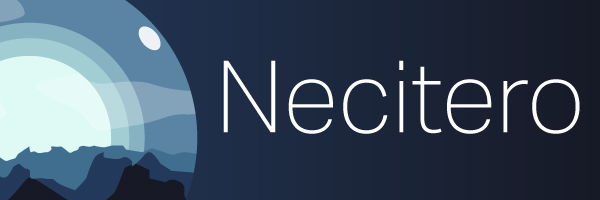

# Necitero

Hi, I’m @Necitero

I was born in May 2000 (you do the maths) and I code a bunch of stuff. My repositories are currently all private, but I am absolutely great at what I do (source: Trust me, bro).

## Personal 🗝️

### Plans and WIP 🔨

- Switch from GitHub to Codeberg
- Write a private voice assistant ✋🏻 (On hold due to priority shift)
- Write a private Discord Music Bot in TypeScript ✋🏻 (On hold due to priority shift)
- Write my very much needed and overdue homepage ✏️
- Build a React.JS + Strapi CMS powered solution for various entities (e.g. schools, animal shelters, etc.) (open-source)
- Make the world a better place

### Finished Projects 🎉

- 2025-09-27 | Upgrade and modernize my favorite tattoo and piercing studio's website ✅

### Ongoing Projects 🔁

- Since 2025-11-10 | Maintain my own dotfiles repository

## Professional Career 💼

### Resume 📄

- Creative Web Developer @ SYZYGY, Frankfurt Germany (2023 – now) ✏️
- Junior Creative Web Developer @ SYZYGY, Frankfurt Germany (2022 – 2023)
- Design apprenticeship @ Werbeagentur Wolkenkratzer, Frankfurt Germany (2019 – 2022)
- Webdesign, -maintaining and -development internship @ Coastline Communications, Darmstadt Germany (2016 - 2017)

### Projects 🔨

- ⭐ SYZGY Internal AI Project under NDA | Developer | NDA (2025 - now) ✏️
- 🏍️ BMW Motorrad | Email Templates | Developer | Angular (2025 – now) ✏️
- 🚙 Hyundai Motor Europe | Product Information Page Evolution | Developer | React (2025 – now) ✏️
- 🤖 AI Project under NDA | Developer | NDA (2025)
- ⭐ SYZYGY Group | Internal base design system | Developer | React (2025)
- 🚙 Mazda Motor Europe | Component library | Developer | React (2025)
- ✈️ Lufthansa Group | Multivariant testing and sales push campaigns | Dev Support | Typescript (2025)
- ✈️ Lufthansa Group | Design system development | Dev contributor | Lit (2023 – 2024)
- ✈️ Lufthansa Group | Multivariant testing and sales push campaigns | Lead dev and strategic sparring partner | Typescript (2022 – 2024)
- ✈️ Lufthansa Group | Email development | Dev contributor | React (2022 – 2023)

### Important for hiring agents 🔎

I am open for new challenges at any time, just keep in mind:

- An amazing team, fun projects, constant learning and ethical products are what I am looking for.
- Preferably, I would love to start at companies, leaving the agency world, but: My previous points hold full priority.
- I am open for a job in Frankfurt am Main (maximum 2 days in office) or anywhere else in Germany (full-remote or 1-2 days per month if travel and hotel costs are covered)
- I specialize in Web Front-End development / engineering, especially in design systems and prototype work. I am open for and interested in Full-Stack Development but will require proper training.
- AI (Articifial Intelligence) is absolutely astonishing, though, I am very critical of its over-usage and pure reliance on it, trying to avoid it most of the time. In other words: If you are looking for an "AI Developer" (which mostly means: Using OpenAI API, writing a few prompts and creating tailored workflows), I might be your guy, but I won't be happy for long.
- If you still believe I might be a good match, drop a message at my [LinkedIn](https://www.linkedin.com/in/nico-borst-94861427b/). I try to check it at least once a week, so please be patient when waiting for a response.
